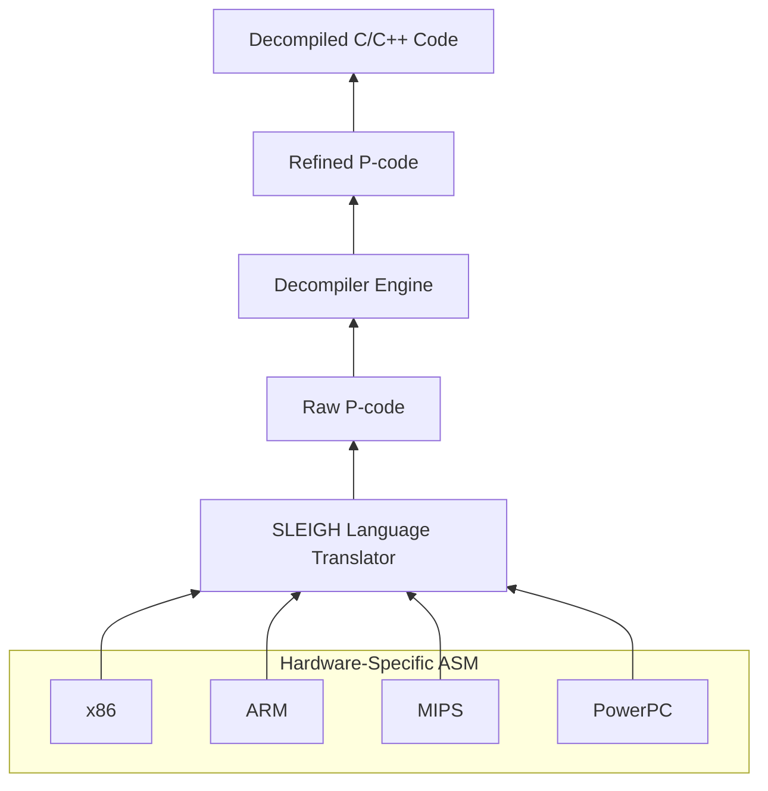

# **Programming with P-Codes in Ghidra**
## **Why Care about P-Codes?**

P-code is Ghidra’s intermediate representation (IR) used to abstract (a.k.a "lift") assembly instructions across different CPU architectures. It simplifies analysis and enables automated reverse engineering by explicitly representing instruction semantics.


P-code offers a few unique advantages for reverse engineering and program analysis:
+ **Architecture Abstraction**: Provides a uniform representation across different CPU architectures.
+ **Explicit Side-Effects**: Clearly represents side-effects of assembly instructions that may not be immediately apparent.
+ **Built-In Data Flow**: Used for data-flow tracking, taint analysis, and symbolic execution. (Only supported by Refined pcodes though.)

The following table illustrates how these features facilitate two critical program analysis strategies. 

|Feature|Emulation|Static Analysis|
|:---:|:----:|:-----:|
|Architecture Abstraction|X|X|
|Explicit Side-Effects|X||
|Built-In Data Flow||X|

## Raw and Refined P-Codes ##

Ghidra defines two types of p-codes that share the same syntax but differ fundamentally in semantics. Although Ghidra itself does not assign specific names to these types, many articles and discussions refer to them as *raw* or *low* p-codes and *refined* or *high* p-codes, respectively.

+ **Raw P-code (Low P-code)**
  + **Generated by:** The SLEIGH language translator from processor specification files (`.sla`).
  + **Level:** Low-level, closely mirrors the original machine instructions.
  + **Purpose:** Serves as a detailed, accurate breakdown of the instruction’s hardware-level effects.
  + **Characteristics:**
    - Direct translation from binary opcodes.
    - Represents micro-operations (e.g., shifts, masking, flag updates).
    - Contains temporary registers and precise bit-level manipulations.
    - Not optimized for readability or high-level logic.


+ **Refined P-code (High P-code)**
  + **Generated by:** Ghidra’s decompiler after semantic lifting, type recovery, and optimization.
  + **Level:** Higher-level abstraction that aligns with source code constructs.
  + **Purpose:** Aims to reconstruct the program's intent and simplify control and data flow.
  + **Characteristics:**
    - Abstracts low-level hardware details.
    - Introduces cleaner expressions and temporary variables.
    - In Static Single Assignment (SSA) form
    - Aids in reconstructing functions, loops, and conditionals.




**Summary Table - Comparison Between Raw and Refined P-codes**

| Feature              | Raw P-code                  | Refined P-code              |
|----------------------|-----------------------------|-----------------------------|
|**Syntax**| P-Code| P-Code|
| **Generated by**     | SLEIGH                      | Decompiler engine           |
| **Level**            | Low-level (CPU behavior)    | High-level (source logic)   |
| **Use case**         | Emulation, lifting | Decompilation, analysis  |
| **Hardware-specific?** | No                       | No                          |
| **Human readability**| Low                         | High                        |
| **In SSA form?**     | No                   | Yes                      |

## **Where to Find More Information?**

/docs/GhidraAPI_javadoc/api/ghidra/program/model/pcode/PcodeOp.html

/docs/GhidraAPI_javadoc/api/ghidra/program/model/pcode/PcodeOpAST.html

/docs/languages/index.html

## **P-Code Syntax**

A p-code operation is the analog of a machine instruction. 
+ A Machine Instruction
  + **opcode**: the action taken by this instruction (e.g., `ADD`, `JMP`, and etc.). 
  + **oprand**: the input(s) and output of this instruction (e.g., a register, a memory address, and etc.)
  + **Side Effects**: a machine instruction may have side effects (e.g., by implicitly changing flag registers.)
+ A p-code operation
  + **opcode**: the action taken by this p-code operation
  + **varnode**: the input(s) and output of this p-code operation. 
  + **Side Effects**: for almost all p-code operations, only the output varnode can have its value modified; there are no indirect effects of the operation. 

```python
cnt = 0
myListing = currentProgram.getListing()
instructionIterator = myListing.getInstructions(True)
for inst in instructionIterator:
    cnt += 1
    if cnt > 9:
      break #only display the first few instructions. 
    pcodeList = inst.getPcode()
    print("{}".format(inst))
    for pcode in pcodeList:
      print("  {}".format(pcode))
```

**Question:** Are these p-code operations raw p-codes or refined p-codes?

**Answer:** They are raw p-codes directly translated from assembly instructions. 

As we can find from the outputs, each of these p-code operations include a p-code opcode/operator, an output if existing, and zero or more inputs. 

### **P-Code Operator/Opcode**

From [/docs/languages/index.html](https://spinsel.dev/assets/2020-06-17-ghidra-brainfuck-processor-1/ghidra_docs/language_spec/html/pcodedescription.html), you can find the detailed description of various p-code opcodes, which will be essential to the understanding of semantics of p-code operations. 

+ COPY
+ LOAD
+ STORE
+ BRANCH
+ CBRANCH
+ BRANCHIND
+ CALL
+ CALLIND
+ INT_EQUAL
+ INT_NOTEQUAL
+ INT_LESS: This is an unsigned integer comparison operator.
+ INT_SLESS: This is a signed integer comparison operator.
+ INT_LESSEQUAL: This is an unsigned integer comparison operator.
+ INT_SLESSEQUAL: This is a signed integer comparison operator. 

Here are some methods in `PcodeOp` that retrieve information of p-code operators/opcodes. 
+ `getMnemonic()`: get the string representation of the pcode opcode. 
+ `getMnemonic(int op)`: get the string representation of for the integer value of a specific pcode opcode.
+ `getOpcode()`: get the integer value for this pcode opcode. 
+ `getOpcode(String s)`: get the integer value for a specific pcode opcode in string.

```python
# For P-Code Demo
# @category: CEG7420.Demo
# @author: Junjie Zhang

cnt = 0
myListing = currentProgram.getListing()
instructionIterator = myListing.getInstructions(True)
for inst in instructionIterator:
    
    cnt += 1
    if cnt > 1000:
      break #only display the first few instructions. 

    pcodeList = inst.getPcode()
    print("{}".format(inst))
    for pcode in pcodeList:
      print("\t{}".format(pcode))
      print("\t\topcode in integer and in string: {}, {}".format(pcode.getOpcode(), pcode.getMnemonic()))

print("the opcode string for 1 is {}".format(pcode.getMnemonic(1)))
print("the opcode integer for INT_EQUAL is {}".format(pcode.getOpcode("INT_EQUAL")))
```


You can use the staic filds in `PCodeOp` class to get p-code operations with a specific opcode type, e.g., `PcodeOp.CALL`. Please do not forget to import `PcodeOp` from the package.  

```python
# For P-Code Demo
# @category: CEG7420.Demo
# @author: Junjie Zhang

#to only print p-code operations that are CALL p-code operators
from ghidra.program.model.pcode import PcodeOp
cnt = 0
myListing = currentProgram.getListing()
instructionIterator = myListing.getInstructions(True)
for inst in instructionIterator:
    pcodeList = inst.getPcode()
    print("{}".format(inst))
    for pcode in pcodeList:
    	if pcode.getOpcode() == PcodeOp.CALL:
    		print("\t{}".format(pcode))
```


### **P-Code Varnodes**