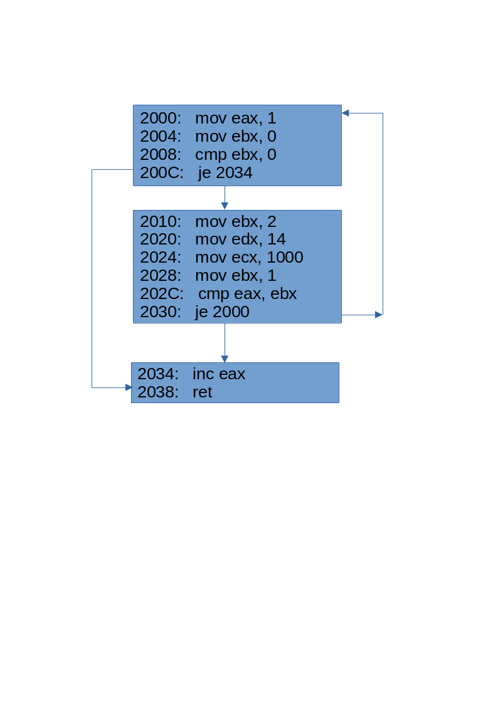

# **Ghidra Scripting: Working with Basic Blocks**

## By [**Dr. Junjie Zhang**](https://jzhang369.github.io/)

## **Why Basic Blocks Matter?**

A **basic block** is a sequence of consecutive instructions in a program with the following characteristics:  

- **Single Entry Point:** Execution always starts at the first instruction of the block and cannot be entered at any other point within the block.  
- **Single Exit Point:** Execution always exits from the last instruction of the block, either through a jump, or branch.  
- **Linear Flow:** There are no jumps or branches within the block itself, except at the end. 

It is worth noting that when constructing basic blocks, function calls are generally treated as regular instructions rather than as jumps or branches. 

### **Example:**  
```assembley
2000:   mov eax, 1        
2004:   mov ebx, 0        
2008:   cmp ebx, 0
200C:   je 2034           
2010:   mov ebx, 2
2020:   mov edx, 14       
2024:   mov ecx, 1000     
2028:   mov ebx, 1        
202C:   cmp eax, ebx        
2030:   je 2000
2034:   inc eax
2038:   ret          
```
For this example, we have three basic blcoks. 

```assembley
;Basic Block 1
2000:   mov eax, 1        
2004:   mov ebx, 0        
2008:   cmp ebx, 0
200C:   je 2034  
;Basic Block 2         
2010:   mov ebx, 2
2020:   mov edx, 14       
2024:   mov ecx, 1000     
2028:   mov ebx, 1        
202C:   cmp eax, ebx        
2030:   je 2000
;Basic Block 3
2034:   inc eax
2038:   ret 
```




**Basic blocks** are fundamental building blocks for constructing a **Control Flow Graph (CFG)**. A CFG is typically generated for one function. Therefore, the process of constructing a CFG from basic blocks belongs to intra-procedural analysis. Basic blocks of *a function* and their connections collectively form the CFG of this function.  

+ **Nodes**: each node is a basic block.
+ **Edges**: each edge represents an execution path from one basic block to another basic block through a jump or a branching instruction. 

By connecting basic blocks based on control flow, a CFG provides a graphical representation of how control passes through a program.  

CFGs and basic blocks help analysts to model the program for:

+ Understanding the structure of the program
+ Profiling the coverage at runtime
+ Perform control flow analysis, e.g., constraint and reachability analysis
+ Vulnerability discovery
+ Guide static or/and dynamic analysis of binaries. 


## **Where to Find More Information?**

For more detailed information on working with basic blocks in Ghidra, you can refer to the following documentation:


`BasicBlockModel`: docs/GhidraAPI_javadoc/api/ghidra/program/model/block/BasicBlockModel.html

`CodeBlock`: docs/GhidraAPI_javadoc/api/ghidra/program/model/block/CodeBlock.html

## **Working with Basic Blocks**
To generate basic blocks for a binary, you will need to use the `BasicBlockModel` class. Each basic block is a sequence of consecutively executed instructions.  

Important Methods in `BasicBlockModel`:
Important Methods in `BasicBlockModel`:

1. **`getCodeBlocks(TaskMonitor monitor)`**: Get an iterator over the code blocks in the entire program.
2. **`getCodeBlocksContaining(Address addr, TaskMonitor monitor)`**: Get all the Code Blocks containing the address.
3. **`getCodeBlocksContaining(AddressSetView addrSet, TaskMonitor monitor)`**: Get an iterator over CodeBlocks which overlap the specified address set.
4. **`getFlowType(CodeBlock block)`**: Return in general how things flow out of this node. (similar to the reference type). 

An example - **enumerating all basic blocks in a binary**

```python
# Ghidra Scripting: Basic Blocks 
# @category: GhidraScripting 
# @author: Junjie Zhang

# To enumerate all basic blocks in a binary.
from  ghidra.program.model.block import BasicBlockModel
myBlockModel = BasicBlockModel(currentProgram)
myBasicBlocks = myBlockModel.getCodeBlocks(monitor)
for i in myBasicBlocks:
	print(i)
```

Another example - **enumerating basic block objects in a Function**

```python
# Ghidra Scripting: Basic Blocks 
# @category: GhidraScripting 
# @author: Junjie Zhang

# To enumerate all basic blocks in the current function.

from ghidra.program.model.block import BasicBlockModel
myBlockModel = BasicBlockModel(currentProgram)
currentFunc = getFunctionContaining(currentAddress)
if currentFunc:
	fbody = currentFunc.getBody()
	myBasicBlocks = myBlockModel.getCodeBlocksContaining(fbody, monitor) #fbody is an instance of the AddressSetView class
	for i in myBasicBlocks:
		name = i.getName()
		print('Name: {}, Starting Address: {}'.format(name, i.getFirstStartAddress()))
```

### **Understanding the `CodeBlock` class**

The `CodeBlock` class represents these basic blocks in Ghidra. It provides methods for identifying and interacting with individual basic blocks within a program.  

1. **`Address[] getStartAddresses()`**: Get all the entry points to this block. 
2. **`Address getFirstStartAddress()`**: Return the first start address of the CodeBlock.
3. **`FlowType getFlowType()`**: Return, in theory, how things flow out of this node. 
4. **`CodeBlockReferenceIterator getSources(TaskMonitor monitor)`**: Get an Iterator over the CodeBlocks that flow into this CodeBlock.
5. **`CodeBlockReferenceIterator getDestinations(TaskMonitor monitor)`**: Get an Iterator over the CodeBlocks that are flowed to from this CodeBlock.

### **Understanding the `CodeBlockReference` Class**

A `CodeBlockReference` object represents an edge in the CFG. **Nevertheless, it is worth noting that an incoming reference may represent a `DATA` or `INDIRECTION` reference. In such cases, you may want to exclude them from your analysis by verifying the reference types.**


For a basic block object, its `getSources(TaskMonitor monitor)` method will return Iterator of <u>**`CodeBlockReference`**</u> over the CodeBlocks that flow into this CodeBlock; its `getDestinations(TaskMonitor monitor)` will return an Iterator of <u>**`CodeBlockReference`**</u> over the CodeBlocks that are flowed to from this CodeBlock. 

The `CodeBlockReference` class represents an edge between a source code block (basic block) and its destination code block (basic block).  

- When you use the `getSources(TaskMonitor monitor)` method on a `CodeBlock` object, you receive an iterator of `CodeBlockReference` objects. Each `CodeBlockReference` object provides:  
  - **`getSourceAddress()`**: The address of the first instruction in the source code block.  
  - **`getDestinationAddress()`**: The address of the first instruction in the current code block, which is the destination of the edge.  

- Similarly, when you use the `getDestinations(TaskMonitor monitor)` method on a `CodeBlock` object, you receive an iterator of `CodeBlockReference` objects. Each `CodeBlockReference` object provides:  
  - **`getSourceAddress()`**: The address of the first instruction in the current code block, which serves as the source of the edge.  
  - **`getDestinationAddress()`**: The address of the first instruction in the destination code block.  


- The `getFlowType()` method is essential. In a `CodeBlock`, when using `getSources()`, it may return references of type `DATA` or `INDIRECTION`. These references do not represent actual incoming edges. Therefore, it is advisable to verify the type of each reference object and discard the irrelevant ones.  


```python
# Ghidra Scripting: Basic Blocks 
# @category: GhidraScripting 
# @author: Junjie Zhang

# For one basic block, enumerate all incoming edges and outgoing edges; 
# and for each edge, display the source address and the destination address

from ghidra.program.model.block import BasicBlockModel


myBlockModel = BasicBlockModel(currentProgram)

addr = askAddress("Ghidra Scripting: Basic Blocks", "Give me an address of a basic block:")

myBasicBlock = myBlockModel.getFirstCodeBlockContaining(addr, monitor)

print("Identified Basic Block: {}".format(myBasicBlock.getName()))

incomingEdges = myBasicBlock.getSources(monitor)
outgoingEdges = myBasicBlock.getDestinations(monitor)

while incomingEdges.hasNext():
	i = incomingEdges.next()
	print("incoming edge: src: {}, dest: {}".format(i.getSourceAddress(), i.getDestinationAddress()))

while outgoingEdges.hasNext():
	i = outgoingEdges.next()
	print("outgoing edge: src: {}, dest: {}".format(i.getSourceAddress(), i.getDestinationAddress()))
```


### **Application: Reachability Analysis**  

Given a basic block, identify all basic blocks from which the current basic block is reachable.  


```python
# Ghidra Scripting: Basic Blocks 
# @category: GhidraScripting 
# @author: Junjie Zhang


#Given a basic block, identify all basic blocks from which the current basic block is reachable.

from ghidra.program.model.block import BasicBlockModel

myBlockModel = BasicBlockModel(currentProgram)
addr = askAddress("Ghidra Scripting: Basic Blocks", "Give me an address of a basic block:")
targetBasicBlock = myBlockModel.getFirstCodeBlockContaining(addr, monitor)

if not targetBasicBlock:
	exit()

processedBasicBlocks = set()
toBeProcessedBasicBlocks = [targetBasicBlock]

while len(toBeProcessedBasicBlocks) > 0:
	one = toBeProcessedBasicBlocks.pop(0) # to dequeue the array
	processedBasicBlocks.add(one)
	incomingEdges = one.getSources(monitor)
	while incomingEdges.hasNext():
		incomingRef = incomingEdges.next()
		# an incoming ref can be DATA or INDIRECTION. So you may want to exclude them.
		if incomingRef.getFlowType().hasFallthrough() or incomingRef.getFlowType().isJump():
			srcBasicBlock = incomingRef.getSourceBlock()
			if srcBasicBlock:
				if not (srcBasicBlock in processedBasicBlocks):
					toBeProcessedBasicBlocks.append(srcBasicBlock)

print("The target basic block {} is reachable from the following basic blocks:".format(targetBasicBlock.getName()))
print([i.getName() for i in processedBasicBlocks])
```