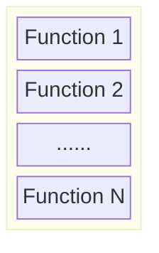

# **Ghidra Scripting: Working with Functions**

## By [**Dr. Junjie Zhang**](https://jzhang369.github.io/)

## **Why Functions Matter?**

Functions are fundamental units of modularity and abstraction in software development. They enable developers to decompose complex systems into smaller, manageable components, facilitating 
+ Code reuse, 
+ Readability, 
+ Maintainability, and 
+ Testing. 

In the context of software reverse engineering, functions serve as critical analysis targets. Typical function-oriented reverse engineering tasks include, but are not limited to, 

+ Recover function boundaries, 
+ Infer meaningful names, 
+ Reconstruct signatures (including return types and parameters), and 
+ Understand the logic implemented within each function. 

The indepth understanding of functions is essential for tasks such as vulnerability discovery, malware analysis, and binary lifting.

Function analysis can generally be categorized into two strategies:

+ **Intra-Procedural Analysis**: This approach focuses on analyzing a single function in isolation, without considering its interactions with other functions. Common tasks include:
  + Inferring function names
  + Generating control flow graphs (CFGs)
  + Performing similarity analysis
  + Conducting taint analysis
  + Examining data flow within the function
  + And more

+ **Inter-Procedural Analysis**: This strategy involves analyzing one or more functions while taking into account their calling contexts and interactions with other functions. Typical applications include: 
  + Building call graphs
  + Performing whole-program taint analysis
  + Executing whole-program data flow analysis
  + Applying symbolic execution across function boundaries
  + And more

In this lecture, we will focus on foundational scripting skills in Ghidra to support intra-procedural analysis. Specifically, we will work on syntactic analysis techniques rather than deeper semantic analyses such as taint tracking or data flow analysis.

## **Where to Find More Information?**


Most relevant documentation for working with functions in Ghidra can be found in the official Javadoc at:

**/docs/GhidraAPI_javadoc/api/ghidra/program/model/listing/Function.html**

This resource provides detailed descriptions of the Function class and its methods, which are essential for scripting and analyzing functions programmatically.


## **Working with Functions**

### **Function Layout in a Binary**

In a typical binary executable, the `.text` section contains the machine code for all defined (non-inline) functions. These functions are generally laid out in a **sequential (or consecutive)** manner in memory. That is, one function usually begins immediately after the previous one ends, though this layout may include padding to satisfy alignment constraints. For example, if one function ends at address 0x1000, the next might begin at 0x1010 depending on the required alignment.





### **Retrieving One Function Object in Ghidra**


Ghidra's `FlatProgramAPI` provides several convenient methods to access Function objects within a binary. These methods allow you to retrieve specific functions based on their name, address, or relative position:

- `getFirstFunction()` / `getLastFunction()` : Retrieves the first or last function in the program.
  
- `getFunction(String name)` : Returns a function by its name, if it exists.


- `getFunctionAt(Address entryPoint)` : Retrieves a function located exactly at the given entry point address.

- `getFunctionContaining(Address address)` : Returns the function that contains the specified address (e.g., the address of an instruction or variable).

- `getFunctionAfter(Address address)`  : Gets the next function after the specified address.

- `getFunctionBefore(Address address)` : Gets the previous function before the specified address.

These methods provide the foundation for navigating and analyzing functions through scripting in Ghidra.

Here are some examples: 

```python
# Get a function using getFirstFunction()
func = getFirstFunction()
print(func)
```

```python
# Get a function using getFunction(String name)
name = "xyz"
func = getFunction(name)
if func is not None:
	print(func)
else:
	print("Function with {} does not exist.".format(name))
```

```python
# Get a function using getFunctionAt(Address address)
addr = currentAddress # currentAddress is the address indicated by your cursor. 
func = getFunctionAt(addr)
if func is not None:
	print(func)
else:
    print("Function with {} as the entry point does not exist.".format(addr))
```


```python
# Get a function using getFunctionContaining(Address address)
addr = currentAddress # currentAddress is the address indicated by your cursor. 
func = getFunctionContaining(addr)
if func is not None:
	print(func)
else:
	print("Function containing {} does not exist.".format(addr))
```

### **Enumerating all Functions in a Binary**


The methods in `FlatProgramAPI` can be used to enumerate all functions in a binary. 

- `getFunctionAfter(Address address)`  : Returns the next function in memory after the specified address. Even if the address lies within a function, this method returns the one that starts *after* it.

- `getFunctionAfter(Function function)` : Returns the next function in memory after the entry point of the given function. This is helpful for forward traversal of functions based on layout in memory.

- `getFunctionBefore(Address address)` : Returns the last function that starts before the given address. If the address lies inside a function, the method still returns the one that starts before it.

- `getFunctionBefore(Function function)` : Returns the function whose entry point is located just before the entry point of the provided function. This is useful for backward traversal of functions.

```python
# Enumerate all functions using getFunctionAfter(Function function)
func = getFirstFunction()
while func:
	print(func)
	func = getFunctionAfter(func)
```


```python
# Enumerate all functions using getFunctionBefore(Function function)
func = getLastFunction()
while func:
	print(func)
	func = getFunctionBefore(func)
```

In addition to use these methods in `FlatProgramAPI`, you can also use `FunctionManagerDB` class. A `FunctionManagerDB` object can be returned by the `getFunctionManager()` method in defined the `ProgramDB` class. Again, `currentProgram` is an object of the `ProgramDB` class. 


The `FunctionManagerDB` class provides a powerful set of methods for querying and iterating over functions stored in a program database. These methods are especially useful for batch processing, function-level analysis, and constructing custom analyses or reports in Ghidra scripts.

- `getFunctionCount()`  : Returns the total number of functions defined in the current program. 

- `getFunctions(boolean forward)` : Returns an iterator over all functions in the program, ordered either in ascending (`true`) or descending (`false`) address order. 

- `getFunctions(Address start, boolean forward)` : Returns an iterator starting from a specific address, moving forward or backward depending on the `forward` flag. 

- `getFunctions(AddressSetView asv, boolean forward)` : Returns an iterator over all functions whose entry points fall within a given `AddressSetView`, ordered by address direction. 

An Example: 

```python
# Enumerate all functions using FunctionManagerDB
fm = currentProgram.getFunctionManager()
allFuncs = fm.getFunctions(True)
for f in allFuncs:
	print(f)
```

### **Retrieving Useful Information from a Function Object**

When working with a `Function` object in Ghidra, you can extract a wide range of properties that may be useful for analysis or scripting:

- **Function Name**
- **Calling Convention**
  - `__cdecl`: Caller cleans the stack; Arguments passed right-to-left
  - `__stdcall`: Callee cleans the stack; Arguments passed right-to-left
  - `__fastcall`: Callee cleans the stack; First 1–2 arguments passed in registers (e.g., ECX, EDX); Remaining arguments on stack (right-to-left)
  - ......
- **Function Signature**
  - Return type
  - Parameters and their corresponding types
- **Entry Point**: The address of the first instruction in the function.
- **Exit Point**: The address of the last instruction in the function.
- **Function Size**: The number of bytes that comprise the function body.
- **Function Type**
  - *Internal function*: a function whose implementation resides within the binary being analyzed.  
  - *External function*: a function that is declared but not implemented in the current binary; it is typically implemented in another library  
  - *Inline function*: a function whose code has been copied directly into the caller during compilation, so it does not appear as a distinct function in the binary.  
  - *Thunk function*: a function corresponds to a fragment of code which simply passes control to a destination function (e.g., for DLL import resolution). 

- **Parameters**
  - Retrieve the name and type of each parameter
  - Modify the name and type of each parameter
- **Local Variables**
  - Retrieve the name and type of each local variable
  - Modify the name and type of each local variable
- **Return Variable**
  - Retrieve the name and type of the return variable

In addition to retrieving the information, you can also set certain information such as 
+ The variable name and the type,
+ The calling convention, and 
+ The comment. 


```python
# Retrieve useful properties from a function object.
# @category: GhidraScripting.Demo
# @author: Junjie Zhang

from ghidra.program.model.symbol import SourceType


fm = currentProgram.getFunctionManager()
allFuncs = fm.getFunctions(True)

flag = True

for f in allFuncs:

    f_body = f.getBody() #f_body is AddressSetView
    
    print("-"*10)
    print("name:\t\t{}".format(f.getName()))
    print("calling convention:\t\t{}".format(f.getCallingConventionName()))
    print("signature:\t\t{}".format(f.getSignature()))
    print("entry address:\t\t{}".format(f.getEntryPoint()))
    print("exit address:\t\t{}".format(f_body.getMaxAddress()))
    print("size of function body:\t\t{}".format(f_body.getNumAddresses()))
    print("internal function:\t\t{}".format(not f.isExternal()))
    print("external function:\t\t{}".format(f.isExternal()))
    print("inline function:\t\t{}".format(f.isInline()))
    print("thunk function:\t\t{}".format(f.isThunk()))
    
    
    parameter_cnt = f.getParameterCount()
    parameter_list = f.getParameters()
    for i in parameter_list:
        print("parameter:\t\t{}".format(i))
        
        # This is to set the name of the first parameter we see over all functions. 
        if flag:
            flag = False
            i.setName("Temp_XYZ", SourceType.USER_DEFINED) 

    local_variables = f.getLocalVariables()
    for i in local_variables:
        print("local variable:\t\t{}".format(i))
        
        
    ret_variable = f.getReturn()
    ret_variable_type = f.getReturnType()
    
    print("Returned Varaible & Type:\t\t{}:{}".format(ret_variable, ret_variable_type))
```


