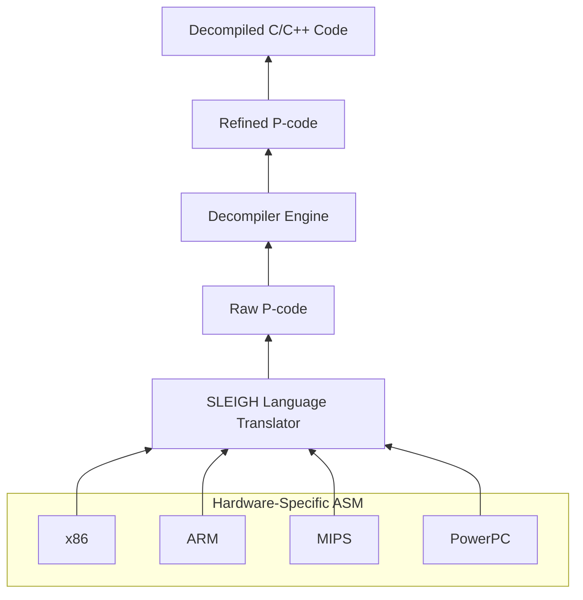

# **Programming with P-Codes in Ghidra**
## **Why Care about P-Codes?**

P-code is Ghidra’s intermediate representation (IR) used to abstract (a.k.a "lift") assembly instructions across different CPU architectures. It simplifies analysis and enables automated reverse engineering by explicitly representing instruction semantics.


P-code offers a few unique advantages for reverse engineering and program analysis:
+ **Architecture Abstraction**: Provides a uniform representation across different CPU architectures.
+ **Explicit Side-Effects**: Clearly represents side-effects of assembly instructions that may not be immediately apparent.
+ **Built-In Data Flow**: Used for data-flow tracking, taint analysis, and symbolic execution. (Only supported by Refined pcodes though.)

The following table illustrates how these features facilitate two critical program analysis strategies. 

|Feature|Emulation|Static Analysis|
|:---:|:----:|:-----:|
|Architecture Abstraction|X|X|
|Explicit Side-Effects|X||
|Built-In Data Flow||X|

## Raw and Refined P-Codes ##

Ghidra defines two types of p-codes that share the same syntax but differ fundamentally in semantics. Although Ghidra itself does not assign specific names to these types, many articles and discussions refer to them as *raw* or *low* p-codes and *refined* or *high* p-codes, respectively.

+ **Raw P-code (Low P-code)**
  + **Generated by:** The SLEIGH language translator from processor specification files (`.sla`).
  + **Level:** Low-level, closely mirrors the original machine instructions.
  + **Purpose:** Serves as a detailed, accurate breakdown of the instruction’s hardware-level effects.
  + **Characteristics:**
    - Direct translation from binary opcodes.
    - Represents micro-operations (e.g., shifts, masking, flag updates).
    - Contains temporary registers and precise bit-level manipulations.
    - Not optimized for readability or high-level logic.


+ **Refined P-code (High P-code)**
  + **Generated by:** Ghidra’s decompiler after semantic lifting, type recovery, and optimization.
  + **Level:** Higher-level abstraction that aligns with source code constructs.
  + **Purpose:** Aims to reconstruct the program's intent and simplify control and data flow.
  + **Characteristics:**
    - Abstracts low-level hardware details.
    - Introduces cleaner expressions and temporary variables.
    - In Static Single Assignment (SSA) form
    - Aids in reconstructing functions, loops, and conditionals.




**Summary Table - Comparison Between Raw and Refined P-codes**

| Feature              | Raw P-code                  | Refined P-code              |
|----------------------|-----------------------------|-----------------------------|
|**Syntax**| P-Code| P-Code|
| **Generated by**     | SLEIGH                      | Decompiler engine           |
| **Level**            | Low-level (CPU behavior)    | High-level (source logic)   |
| **Use case**         | Emulation, lifting | Decompilation, analysis  |
| **Hardware-specific?** | No                       | No                          |
| **Human readability**| Low                         | High                        |
| **In SSA form?**     | No                   | Yes                      |

## **Where to Find More Information?**

/docs/GhidraAPI_javadoc/api/ghidra/program/model/pcode/PcodeOp.html

/docs/GhidraAPI_javadoc/api/ghidra/program/model/pcode/PcodeOpAST.html

/docs/languages/index.html

## **P-Code Syntax**

A p-code operation is the analog of a machine instruction. 
+ A Machine Instruction
  + **opcode**: the action taken by this instruction (e.g., `ADD`, `JMP`, and etc.). 
  + **oprand**: the input(s) and output of this instruction (e.g., a register, a memory address, and etc.)
  + **Side Effects**: a machine instruction may have side effects (e.g., by implicitly changing flag registers.)
+ A p-code operation
  + **opcode**: the action taken by this p-code operation
  + **varnode**: the input(s) and output of this p-code operation. 
  + **Side Effects**: for almost all p-code operations, only the output varnode can have its value modified; there are no indirect effects of the operation. 

```python
cnt = 0
myListing = currentProgram.getListing()
instructionIterator = myListing.getInstructions(True)
for inst in instructionIterator:
    cnt += 1
    if cnt > 9:
      break #only display the first few instructions. 
    pcodeList = inst.getPcode()
    print("{}".format(inst))
    for pcode in pcodeList:
      print("  {}".format(pcode))
```

**Question:** Are these p-code operations raw p-codes or refined p-codes?

**Answer:** They are raw p-codes directly translated from assembly instructions. 

As we can find from the outputs, each of these p-code operations include a p-code opcode/operator, an output if existing, and zero or more inputs. 

### **P-Code Operator/Opcode**

From [/docs/languages/index.html](https://spinsel.dev/assets/2020-06-17-ghidra-brainfuck-processor-1/ghidra_docs/language_spec/html/pcodedescription.html), you can find the detailed description of various p-code opcodes, which will be essential to the understanding of semantics of p-code operations. 

+ COPY
+ LOAD
+ STORE
+ BRANCH
+ CBRANCH
+ BRANCHIND
+ CALL
+ CALLIND
+ INT_EQUAL
+ INT_NOTEQUAL
+ INT_LESS: This is an unsigned integer comparison operator.
+ INT_SLESS: This is a signed integer comparison operator.
+ INT_LESSEQUAL: This is an unsigned integer comparison operator.
+ INT_SLESSEQUAL: This is a signed integer comparison operator. 

Here are some methods in `PcodeOp` that retrieve information of p-code operators/opcodes. 
+ `getMnemonic()`: get the string representation of the pcode opcode. 
+ `getMnemonic(int op)`: get the string representation of for the integer value of a specific pcode opcode.
+ `getOpcode()`: get the integer value for this pcode opcode. 
+ `getOpcode(String s)`: get the integer value for a specific pcode opcode in string.

```python
# For P-Code Demo
# @category: CEG7420.Demo
# @author: Junjie Zhang

cnt = 0
myListing = currentProgram.getListing()
instructionIterator = myListing.getInstructions(True)
for inst in instructionIterator:
    
    cnt += 1
    if cnt > 1000:
      break #only display the first few instructions. 

    pcodeList = inst.getPcode()
    print("{}".format(inst))
    for pcode in pcodeList:
      print("\t{}".format(pcode))
      print("\t\topcode in integer and in string: {}, {}".format(pcode.getOpcode(), pcode.getMnemonic()))

print("the opcode string for 1 is {}".format(pcode.getMnemonic(1)))
print("the opcode integer for INT_EQUAL is {}".format(pcode.getOpcode("INT_EQUAL")))
```


You can use the staic filds in `PCodeOp` class to get p-code operations with a specific opcode type, e.g., `PcodeOp.CALL`. Please do not forget to import `PcodeOp` from the package.  

```python
# For P-Code Demo
# @category: CEG7420.Demo
# @author: Junjie Zhang

#to only print p-code operations that are CALL p-code operators
from ghidra.program.model.pcode import PcodeOp
cnt = 0
myListing = currentProgram.getListing()
instructionIterator = myListing.getInstructions(True)
for inst in instructionIterator:
    pcodeList = inst.getPcode()
    print("{}".format(inst))
    for pcode in pcodeList:
    	if pcode.getOpcode() == PcodeOp.CALL:
    		print("\t{}".format(pcode))
```


### **P-Code Varnodes**

Each input or output is a **varnode**, where **a varnode is a triple of an address space, an offset into the space, and a size. It refers to a contiguous seqeunce of bytes (defined by the size) startting from the offset in address space**.

Ghidra defines four types of address spaces:
+ **ram**: this varnode is in memory. Memory addressable by the program. For example, `BRANCH` and `CBRANCH` can use it, to indicate the address of the execution target.
+ **register**: this varnode is in a register.
+ **constant**: this varnode is a constant value (i.e., an immediate value). 
+ **unique** (a.k.a., temporary): this varnode is a temporary node and it does not exist anywhere.
+ **stack**: for varnodes in refined p-code instructions. 

Here is a code snippet to explore varnodes. 

```python
# For P-Code Demo
# @category: CEG7420.Demo
# @author: Junjie Zhang

#to explore varnode methods and display the information
from ghidra.program.model.pcode import PcodeOp
cnt = 0
myListing = currentProgram.getListing()
instructionIterator = myListing.getInstructions(True)
for inst in instructionIterator:
    pcodeList = inst.getPcode()
    print("{}".format(inst))
    for pcode in pcodeList:
    	print("\t{}".format(pcode))
    	output = pcode.getOutput()
    	inputs = pcode.getInputs()
    	if output:
    		print("\t\toutput: {}".format(output))
    		print("\t\t\tRam/Address Space?: {}".format(output.isAddress()))
    		print("\t\t\tConstant Space?: {}".format(output.isConstant()))
    		print("\t\t\tRegister Space?: {}".format(output.isRegister()))
    		print("\t\t\tTemporary/Unique Space?: {}".format(output.isUnique()))
    		print("\t\t\tOffset: {}, with size: {}".format(output.getOffset(), output.getSize()))
    		print("\t\t\tInteger Value for The Space: {}".format(output.getSpace()))
    	for vn in inputs:
    		print("\t\tinput: {}".format(vn))
    		print("\t\t\tRam/Address Space?: {}".format(vn.isAddress()))
    		print("\t\t\tConstant Space?: {}".format(vn.isConstant()))
    		print("\t\t\tRegister Space?: {}".format(vn.isRegister()))
    		print("\t\t\tTemporary/Unique Space?: {}".format(vn.isUnique()))
    		print("\t\t\tOffset: {}, with size: {}".format(vn.getOffset(), vn.getSize()))
    		print("\t\t\tInteger Value for The Space: {}".format(vn.getSpace()))
```


## Mapping Between Assembly Instructions and P-Code Operations

### **From Assembly to P-Code**

We have explored this in previous sections, i.e., using the `getPcode()` method of the `instruction` class. For example, you can use the following code snippet (incomplete). 

```python
# inst is an assembly instruction
for inst in instructionIterator:
    #using getPcode(), you will get a list of pcode operations.
    pcodeList = inst.getPcode()  
    print("{}".format(inst))
    for pcode in pcodeList:
```

### **From P-Code to Assembly**

Every p-code operation is associated with the original machine/assembly instruction where it originates from. It should be made clear that one machine instruction is typically translated into one p-code operation or a sequence of p-code operations. Each p-code operation is uniquely identified by its **sequence number**. 

1. A sequence number contains **the address** of the original assembly instruction the pcode operation originates from.  
1. A sequence number also contains a counter. For a single instruction, a **1-up counter**, starting at zero, is used to enumerate the multiple p-code operations involved in its translation.

```python
# For P-Code Demo
# @category: CEG7420.Demo
# @author: Junjie Zhang

#for a pcode operation, you can find out the address of the assembly instruction, from which this pcode is corresponding to
from ghidra.program.model.pcode import PcodeOp
cnt = 0
myListing = currentProgram.getListing()
instructionIterator = myListing.getInstructions(True)
for inst in instructionIterator:
    pcodeList = inst.getPcode()
    print("{} : {}".format(inst.getAddress(), inst))
    for pcode in pcodeList:
    	print("\t{}".format(pcode))
    	seq = pcode.getSeqnum()
    	print("\t\tseq number: {}".format(seq))
    	print("\t\t\taddress of the assembly instruction this pcode is from: {}".format(seq.getTarget()))	

```
## Refined P-Code

For all examples we have discussed before this section, they are for **raw p-code** or **low p-code**. Here we will focus on refined p-code. 

### SSA 
Refined p-codes are represented in **Static Single Assignment (SSA)** form; raw p-codes are NOT represented in SSA. A key property of SSA is that:

- Ensures **every variable is assigned exactly once**.
- Introduces new unique versions (e.g., `tmp1`, `tmp2`, etc.) for each assignment.
- Makes **data flow analysis**, **value tracking**, and **optimization** easier.
  
SSA simplifies the reasoning about program state, facilitating taint analysis and symbolic execution. 

SSA Examples (Yes/No?):

```python
# Yes or No? 
# No, because x has been written for 3 times. 
x = 5
x = x + 2
x = x * 3
```

```python
# Yes or No?
# Yes, since no variable is written for more than once. 
x1 = 5
x2 = x1 + 2
x3 = x2 * 3
```

```python
# Yes or No?
# No, since x has been written twice. 
if (cond):
    x = 1
else:
    x = 2
    y = x + 3
```


```python
# Yes or No?
# Yes, since no variable is written for more than once.
if (cond):
    x1 = 1
else:
    x2 = 2
    x3 = phi(x1, x2)
    y1 = x3 + 3
```

### Retrieving Refined P-Code Using Ghidra

You will need to firstly decompile a function before you can retrieve refined p-code instructions from the binary. This is fundamentally different from raw p-code instructions, which can be directly translated from assembly instructions. 

```python
# For Refined P-Code Demo
# @category: CEG7420.Demo
# @author: Junjie Zhang

from ghidra.app.decompiler import *

# We will get refined p-code for the current function.
func = getFunctionContaining(currentAddress)
myDecomp = DecompInterface()
myDecomp.openProgram(currentProgram)

if func is None:
    print("No function contains this address.")
    exit()

decomp_results = myDecomp.decompileFunction(func, 30, monitor)
if decomp_results is None:
    print("Fail to decompile this function.")
    exit()

results_highFunction = decomp_results.getHighFunction()
if results_highFunction is None:
    print("Fail to get the high function.")
    exit()

pcode_seq = results_highFunction.getPcodeOps() # This pcode_seq is refined pcode!
cnt = 0
for op in pcode_seq:
    print("{}".format(op.toString()))
```

Refined P-code instructions are obtained after decompilation. Each varnode in refined p-code instructions can be associated with a variable in the decompiled source code (e.g., in c/c++). The following code shows you how to retrieve the source-level information of a varnode in a refined p-code instruction. Here we print out the variable names in decompiled code for varnodes used as function parameters. 

```python
# For Refined P-Code Demo
# @category: CEG7420.Demo
# @author: Junjie Zhang

from ghidra.app.decompiler import *

# We will get refined p-code for the current function.
func = getFunctionContaining(currentAddress)
myDecomp = DecompInterface()
myDecomp.openProgram(currentProgram)

if func is None:
    print("No function contains this address.")
    exit()

decomp_results = myDecomp.decompileFunction(func, 30, monitor)
if decomp_results is None:
    print("Fail to decompile this function.")
    exit()

results_highFunction = decomp_results.getHighFunction()
if results_highFunction is None:
    print("Fail to get the high function.")
    exit()

paramSet = set()

pcode_seq = results_highFunction.getPcodeOps() # This pcode_seq is refined pcode!

for op in pcode_seq:
    output = op.getOutput()
    inputs = op.getInputs()
    for invar in inputs:
        hv = invar.getHigh()
        if hv:
            hs = hv.getSymbol()
            if hs and hs.isParameter():
                paramSet.add(invar)

print("all varnodes in refined pcode that are identified as parameters.")
for invar in paramSet:
    hv = invar.getHigh()
    if hv:
        hs = hv.getSymbol()
        if hs:
            print("varnode: {}, high variable name: {}, symbol name: {}".format(invar, hv.getName(), hs.getName()))
```

### `getDef()` and `getDescendants()`

Both methods of `varnode` are essential to perform taint or data flow analysis on refined p-code. 

+ `getDef()`: get the refined p-code instruction that defines this varnode (a.k.a, uses this varnode the output). 
+ `getDescendants()`: get an iterator of all refined p-code instructions that use this varnode as input. 

```python
# this code snippet is in the SSA form. 
x1 = 1
x2 = 3
y1 = x1 + 5
z1 = y1 * 2
w1 = x1 + x2
```
If you are exploring this instruction `w1 = x1 + x2`, and you get the `x1` variable/varnode in this instruction. 
+ if you call `x1.getDef()`, you should get the definition of `x1`, i.e., the instruction that writes into `x1`. In other words,  `x1.getDef()` should return `x1 = 1`.
+ if you call `x1.getDescendants()`, you should get a list of all instructions that use `x1` as the input. In other words,  `x1.getDescendants()` should return `y1 = x1 + 5` and `w1 = x1 + x2`, where both of them use `x1` as input.  

It helps tracking how data flows in a program by iteratively exploring the definition or descendants of a varnode. For every varnode in each refined p-code instruction, we display its definition instruction and all instructions that use it as input. 

```python
# For Refined P-Code Demo
# @category: CEG7420.Demo
# @author: Junjie Zhang

from ghidra.app.decompiler import *

# We will get refined p-code for the current function.
func = getFunctionContaining(currentAddress)
myDecomp = DecompInterface()
myDecomp.openProgram(currentProgram)

if func is None:
    print("No function contains this address.")
    exit()
decomp_results = myDecomp.decompileFunction(func, 30, monitor)
if decomp_results is None:
    print("Fail to decompile this function.")
    exit()
results_highFunction = decomp_results.getHighFunction()
if results_highFunction is None:
    print("Fail to get the high function.")
    exit()

paramSet = set()
pcode_seq = results_highFunction.getPcodeOps() # This pcode_seq is refined pcode!

for op in pcode_seq:
    print(op)
    output = op.getOutput()
    if output:
        print("\toutput varnode: {}".format(output))
        
        inst_def = output.getDef()
        print("\t\t It is defined by: {}".format(inst_def))
        
        inst_descendants = output.getDescendants()
        for i in inst_descendants:
            print("\t\t It is used by: {}".format(i))
    inputs = op.getInputs()
    for invar in inputs:
        print("\tinput varnode: {}".format(invar))
        inst_def = invar.getDef()
        print("\t\t It is defined by: {}".format(inst_def))
        
        inst_descendants = invar.getDescendants()
        for i in inst_descendants:
            print("\t\t It is used by: {}".format(i))
```